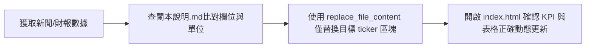

# AI 礦企核心數據對標總表 — 資料對齊與填入快速指引 (AI Agent Quick Guide)

> **本文件目的 (Target Purpose)**：
> 專供 AI Agent / 協作開發者在獲取新聞、財報、研究報告、SEC 申報（10-Q/10-K）或投行研報時，**無需完整讀取專案其他代碼**，即可在 **10 秒內精確將非結構化資料對齊、換算並填入資料庫的正確鍵值與位置**，極致節省 Token 並杜絕單位錯誤。

---

## 0. 極速定位法則 (Token 節省核心)

- **實體資料庫檔案**：`tools/ai-miners-sheet/database.js`
- **活動陣列變數**：`DEFAULT_MINERS_DATA`
- **定位目標公司**：
  使用編輯工具精準搜尋 `ticker: "XXXX"`（例如 `ticker: "IREN"`），**僅檢視與替換該標的之 `{ ... }` 物件區塊，嚴禁呼叫讀取全檔**。
- **支援 9 大既有標的代號**：
  `BTBT` | `CIFR` | `CLSK` | `CORZ` | `HIVE` | `HUT` | `IREN` | `MARA` | `RIOT`
  *(若為新增第 10 家礦企，直接於陣列末尾追加物件)*

---

## 1. 欄位規格與資料型態速查表 (SSOT Schema)

> [!CAUTION]
> **純數字鐵律**：所有 `number` 型態之欄位，**嚴禁帶有 `$`, `M`, `B`, `%`, `MW` 等符號**，必須為純浮點數或整數！格式化字尾均由前端自動渲染。

| 欄位名稱 (Key) | 型態 (Type) | 單位與格式規範 | 來源常見關鍵字 / 換算規則 | 填值範例 |
| :--- | :--- | :--- | :--- | :--- |
| `ticker` | `string` | 大寫美股代碼 | 股票代號 (Symbol) | `"IREN"` |
| `name` | `string` | 公司正式名稱 / 品牌 | Corporate Name | `"Iris Energy Limited"` |
| `exchange` | `string` | 交易所大寫 | `"NASDAQ"` 或 `"NYSE"` | `"NASDAQ"` |
| `modelCategory` | `string` | **限定四選一** | 商業模式核心代碼 | `"Neocloud"` |
| `businessModel` | `string` | 繁中簡短摘要 (15~30字) | 商業模式、GPU 承擔方式、客戶特性 | `"垂直整合 Neocloud (自購 GPU + 超大租賃)"` |
| `price` | `number` | **美元 ($)** (純數字) | 現價、最新收盤價 (Stock Price) | `42.79` |
| `shares` | `number` | **百萬股 (M)** (純數字) | 流通股數 (Diluted Shares Outstanding) | `195` |
| `marketCap` | `number` | **10 億美元 ($B)** (純數字) | 總市值：`(price * shares) / 1000` | `8.344` |
| `netDebt` | `number` | **百萬美元 ($M)** (純數字) | **負數 = 淨現金**；正數 = 淨負債 | `140` *(淨現金-$45M則填 `-45`)* |
| `ev` | `number` | **10 億美元 ($B)** (純數字) | 企業價值：`marketCap + (netDebt / 1000)` | `8.484` |
| `beta` | `number` | 數值小數 (純數字) | 貝他值 (6M / 1Y Beta) | `4.15` |
| `targetPrice` | `number` | **美元 ($)** (純數字) | 法人/分析師目標價 (Consensus Target) | `55.00` |
| `upside` | `number` | **百分比 (%)** (純數字) | 隱含漲幅：`((targetPrice - price) / price) * 100` | `28.5` *(代表 +28.5%)* |
| `range52w` | `string` | `"$最低 - $最高"` | 52-Week Trading Range | `"$3.80 - $48.20"` |
| `opMw` | `number` | **MW** (純數字) | 目前已通電商轉之總電力 (Operational Capacity) | `510` |
| `pipelineMw` | `number` | **MW** (純數字) | 包含已營運與未來總規劃儲備 (Total Pipeline) | `2100` *(若報告寫 2.1 GW，換算為 2100)* |
| `contractedMw` | `number` | **MW** (純數字) | 已簽署具約束力之 HPC/AI 負載 (Contracted IT Load) | `260` |
| `hpcSplit` | `number` | **百分比 (%)** (純數字) | HPC / AI 在營收或電力之佔比估計 | `50` *(代表 50%)* |
| `evMw` | `number` | **百萬美元/MW ($M/MW)** | 估值乘數：`(ev * 1000) / opMw` (純數字) | `8.5` |
| `facilities` | `string` | 繁中字串，分號分隔 | 主要機房園區名稱、州別、土地性質 | `"西德州 Sweetwater 1 & 2；奧克拉荷馬新基地"` |
| `energization` | `string` | 繁中時程說明 | 變電所通電、高壓電網接入進度 | `"Sweetwater 1: 2026.05 已通電 (345kV ERCOT)"` |
| `cod` | `string` | 繁中或季度標註 | 商轉投產預定日 (Commercial Operation Date) | `"Horizon 1: 2026 Q3 交付；全期 2027+"` |
| `majorClients` | `string` | 逗號分隔主要客戶 | Hyperscaler、CSP、AI 夥伴 | `"微軟 (Microsoft), NVIDIA, Dell"` |
| `contracts` | `string` | 繁中合約條款摘要 | 合約年限、合約總額、租賃架構 (NNN / 代工) | `"微軟: 5年 $9.7B (200 MW)；NVIDIA: $3.4B"` |
| `backlogValue` | `number` | **10 億美元 ($B)** (純數字) | 已公開確定在手訂單合約加總 | `13.1` *(131 億美元填 `13.1`)* |
| `backlogText` | `string` | 介面展示文字 | 帶單位的醒目合約展示 | `"$13.1B+ (131 億美元)"` |
| `contractRatio` | `string` | 簡短字串 | 產能鎖定率、售出比例 | `"已售出與鎖定合約達 $13.1B+"` 或 `"100% 鎖定"` |
| `yoy` | `number` | **年增率 (%)** (純數字) | 最新季度營收同比增長率 | `155` *(代表 +155%)* |
| `revenueHistory` | `number[]` | **近四季營收 ($M)** 陣列 | `[Q-3, Q-2, Q-1, 最新季度]` (單位：百萬美元) | `[52, 78, 118, 168]` |
| `capexHistory` | `number[]` | **近四季資本支出 ($M)** | `[Q-3, Q-2, Q-1, 最新季度]` (單位：百萬美元) | `[70, 110, 165, 230]` |
| `latestEpsActual` | `number` | **美元/股** (純數字) | 最新季實際每股盈餘 (Reported Diluted EPS) | `0.25` *(虧損則為負數如 `-0.05`)* |
| `latestEpsEst` | `number` | **美元/股** (純數字) | 市場共識預估 EPS (Consensus EPS) | `0.18` |
| `epsSurprise` | `number` | **驚喜率 (%)** (純數字) | `((Actual - Est) / |Est|) * 100` | `38.9` *(代表 +38.9% Beat)* |
| `colorBadge` | `string` | **指定顏色名稱** | 標籤色彩：`teal` `cyan` `amber` `indigo` `emerald` `purple` `rose` | `"purple"` |

---

## 2. 四大商業模式代碼 (`modelCategory`) 定義標準

在填入 `modelCategory` 時，請嚴格依據公司實際合約模式選擇下列四者之一：

1. **`"Neocloud"` (自營雲模式)**：
   - 特徵：公司自行出資採購 GPU 晶片（如 H100/H200/B200），承擔晶片折舊風險，向上游提供算力雲端服務。
   - 代表：`BTBT` (WhiteFiber), `HIVE` (BUZZ HPC), `IREN`。
2. **`"Wholesale"` (批發機房地主模式)**：
   - 特徵：公司僅出租土地、廠房、電力基建與水電冷卻，**客戶自備晶片**。公司純收高額 NOI (淨營運收入)，**零晶片折舊風險**。
   - 代表：`CIFR` (AWS/Google 機房), `HUT` (超大 Hyperscaler 租賃), `RIOT` (Anthropic 長約)。
3. **`"Turnkey"` (代工託管模式)**：
   - 特徵：客戶深度綁定並出資補貼改建 CapEx，由礦企負責全包營運與電力直供。
   - 代表：`CORZ` (CoreWeave 專案)。
4. **`"PowerReserve"` (電力儲備 / 合資模式)**：
   - 特徵：手握巨量未開發電力與土地，等待大型科技巨頭整批包租，或與地產基金成立合資企業共擔出資。
   - 代表：`CLSK` (德州大園區整批招商), `MARA` (Starwood 合資案)。

---

## 3. 常見單位陷阱與避坑指南 (Common Gotchas)

1. **淨負債 (`netDebt`) 的正負號**：
   - 財報公式：`Net Debt = Total Debt - Cash and Cash Equivalents`。
   - 若公司**現金大於負債**（Net Cash 淨現金），數值必須填寫**負數**（例：手握 $45M 現金無負債，填 `-45`）。
   - 前端會自動識別負數並渲染為 `-$45M (現金)`。
2. **容量單位統一為 MW**：
   - 若研報寫 `2.5 GW`，請乘以 1000 填入 `2500`。
   - 若寫 `60,000 kVA` 或 `60 MVA`，通常對應約 `50~60 MW`。
3. **市值與在手合約單位為 $B (十億美元)**：
   - 若合約總額為 7 億 4000 萬美元 ($740M)，`backlogValue` 請填 `0.74`。
   - 若市值為 2 億 5200 萬美元 ($252M)，`marketCap` 請填 `0.252`。
4. **營收與 CapEx 陣列**：
   - `revenueHistory` 與 `capexHistory` 必須固定維持 **4 個元素**，由左至右分別為：`[三季前, 兩季前, 上一季, 最新季]`。

---

## 4. 單一標的快速填入樣板 (Copy-Paste JSON Template)

若要新增或整筆覆蓋任一公司，請直接使用此空白標準模板：

```javascript
{
  ticker: "XXXX",
  name: "Company Name Inc.",
  exchange: "NASDAQ",
  modelCategory: "Wholesale", // "Neocloud" | "Wholesale" | "Turnkey" | "PowerReserve"
  businessModel: "商業模式一句話說明 (自購晶片 / 批發地主 / 合資)",
  price: 0.00,
  shares: 0,
  marketCap: 0.000, // $B
  netDebt: 0, // $M (負數為淨現金)
  ev: 0.000, // $B
  beta: 1.00,
  targetPrice: 0.00,
  upside: 0.0, // %
  range52w: "$0.00 - $0.00",
  opMw: 0,
  pipelineMw: 0,
  contractedMw: 0,
  hpcSplit: 0, // %
  evMw: 0.0, // $M/MW
  facilities: "基地園區位置與廠房描述",
  energization: "變電所與通電時程進度",
  cod: "商轉交付日期",
  majorClients: "客戶夥伴名單",
  contracts: "合約年限、金額條款摘要",
  backlogValue: 0.00, // $B
  backlogText: "$0.0B",
  contractRatio: "鎖定比例",
  yoy: 0, // %
  revenueHistory: [0, 0, 0, 0], // 近四季營收 ($M)
  capexHistory: [0, 0, 0, 0], // 近四季 CapEx ($M)
  latestEpsActual: 0.00,
  latestEpsEst: 0.00,
  epsSurprise: 0.0, // %
  colorBadge: "cyan" // "teal" | "cyan" | "amber" | "indigo" | "emerald" | "purple" | "rose"
}
```

---

## 5. AI 操作工作流程 SOP (3 步驟收工)



1. **萃取數值**：從文字中提煉數值，依第 1 節換算為標準單位（$B, $M, MW, %）。
2. **就地修改**：使用 `replace_file_content`，目標檔案設為 `tools/ai-miners-sheet/database.js`，搜尋範圍限定於該標的的 `StartLine` ~ `EndLine`，只置換需更新的鍵值。
3. **介面動態即時生效**：修改後重新整理 `tools/ai-miners-sheet/ai-miners-core-metrics-benchmark.html`，頂部 6 大 KPI、總覽清單與側面板將自動同步生效！

---

## 6. 深度微觀財務估值指標擴充規範 (`deepValuation`)

> [!NOTE]
> 當某家礦企有如 `IREN Financial Valuation Metrics.md` 或 `MARA Holdings Financial Modeling Research.md` 等級的買方 DCF 或微觀財務拆解報告時，可為該公司追加 `deepValuation` 嵌套物件。目前已完整支援 **IREN** (Neocloud 垂直整合模式) 與 **MARA** (PowerReserve / Starwood JV 出地出電模式)！**若其他公司暫無此資料，該欄位保持省略或為 `null`，前端會自動適應，完全不影響總表呈現。**

`deepValuation` 支援的 7 大維度子結構：
- `unitEconomics`: 單價營收拆解（如批發託管 $/MW/yr、$/kW/month、Take-or-Pay 合約架構、BTC 直接開採電價與全包現金成本 $/BTC 等）。
- `capexBreakdown`: CapEx 與融資（DLC 機房 $/MW、綠地新建 vs 礦場改裝、土地作價折抵股權、專案債務 LTC%、ASC 842 遞延收入攤銷等）。
- `marginsAndOpex`: 利潤率與 Opex（合約 NOI 利潤率 75%~85%、常態每季現金 SG&A、SBC、實質天然氣/電力成本防禦等）。
- `depreciationPolicy`: 折舊政策（廠房 15-25 年、發電資產 25-30 年、ASIC 礦機 3 年加速折舊、每年折舊衝擊等）。
- `capitalStructure`: 資本結構（各期可轉債買回與餘額、零息債券、合資 SPV 閉鎖準備金條款、未動用 ATM 額度與稀釋折價等）。
- `codMilestones`: 商轉時程陣列 `[ { period, billableMw, sites, category, note } ]` 與 `fcfBreakevenPoint` (自由現金流轉正預估)。
- `dcfDrivers`: 買方 SOTP / DCF 估值輸入矩陣（包含 WACC、終值退出倍數、EBITDA Margin、CapEx、電價等基準/樂觀/悲觀情境數值）。

---

## 7. Google Sheets 即時自動同步設定指引 (Auto-Sync Setup Guide)

> [!TIP]
> **零後端・零指令即時同步架構**：
> 本工作站內建 Google Sheets CSV 解析控制器。透過 Google 試算表的 `=GOOGLEFINANCE(...)` 函數與「發布至網路」功能，由 Google 伺服器負責自動計算最新行情，使用者在開啟工作站或點擊「即時同步」時，前端將以純 JavaScript 非同步抓取最新報價，並自動重算總市值、隱含潛在漲幅、企業價值 (EV) 與 EV/MW！

### 7.1 Google 試算表母表建置範本 (9 大礦企公式)

請於個人的 [Google 試算表 (Google Sheets)](https://sheets.google.com) 建立一個新工作表（建議命名為 `AI_Miners_Sync`），在 `Sheet1` 第 1 列建立以下標題列，第 2 至 10 列直接填入公式：

| 欄位 A (`Ticker`) | 欄位 B (`Price`) | 欄位 C (`MarketCap`) | 欄位 D (`Beta`) | 欄位 E (`Low52`) | 欄位 F (`High52`) | 欄位 G (`TargetPrice`) |
| :--- | :--- | :--- | :--- | :--- | :--- | :--- |
| **BTBT** | `=GOOGLEFINANCE("NASDAQ:BTBT","price")` | `=ROUND(GOOGLEFINANCE("NASDAQ:BTBT","marketcap")/10^9, 3)` | `=ROUND(GOOGLEFINANCE("NASDAQ:BTBT","beta"), 2)` | `=GOOGLEFINANCE("NASDAQ:BTBT","low52")` | `=GOOGLEFINANCE("NASDAQ:BTBT","high52")` | `3.20` *(自訂目標價)* |
| **CIFR** | `=GOOGLEFINANCE("NASDAQ:CIFR","price")` | `=ROUND(GOOGLEFINANCE("NASDAQ:CIFR","marketcap")/10^9, 3)` | `=ROUND(GOOGLEFINANCE("NASDAQ:CIFR","beta"), 2)` | `=GOOGLEFINANCE("NASDAQ:CIFR","low52")` | `=GOOGLEFINANCE("NASDAQ:CIFR","high52")` | `7.50` |
| **CLSK** | `=GOOGLEFINANCE("NASDAQ:CLSK","price")` | `=ROUND(GOOGLEFINANCE("NASDAQ:CLSK","marketcap")/10^9, 3)` | `=ROUND(GOOGLEFINANCE("NASDAQ:CLSK","beta"), 2)` | `=GOOGLEFINANCE("NASDAQ:CLSK","low52")` | `=GOOGLEFINANCE("NASDAQ:CLSK","high52")` | `18.00` |
| **CORZ** | `=GOOGLEFINANCE("NASDAQ:CORZ","price")` | `=ROUND(GOOGLEFINANCE("NASDAQ:CORZ","marketcap")/10^9, 3)` | `=ROUND(GOOGLEFINANCE("NASDAQ:CORZ","beta"), 2)` | `=GOOGLEFINANCE("NASDAQ:CORZ","low52")` | `=GOOGLEFINANCE("NASDAQ:CORZ","high52")` | `24.00` |
| **HIVE** | `=GOOGLEFINANCE("NASDAQ:HIVE","price")` | `=ROUND(GOOGLEFINANCE("NASDAQ:HIVE","marketcap")/10^9, 3)` | `=ROUND(GOOGLEFINANCE("NASDAQ:HIVE","beta"), 2)` | `=GOOGLEFINANCE("NASDAQ:HIVE","low52")` | `=GOOGLEFINANCE("NASDAQ:HIVE","high52")` | `6.00` |
| **HUT** | `=GOOGLEFINANCE("NASDAQ:HUT","price")` | `=ROUND(GOOGLEFINANCE("NASDAQ:HUT","marketcap")/10^9, 3)` | `=ROUND(GOOGLEFINANCE("NASDAQ:HUT","beta"), 2)` | `=GOOGLEFINANCE("NASDAQ:HUT","low52")` | `=GOOGLEFINANCE("NASDAQ:HUT","high52")` | `28.00` |
| **IREN** | `=GOOGLEFINANCE("NASDAQ:IREN","price")` | `=ROUND(GOOGLEFINANCE("NASDAQ:IREN","marketcap")/10^9, 3)` | `=ROUND(GOOGLEFINANCE("NASDAQ:IREN","beta"), 2)` | `=GOOGLEFINANCE("NASDAQ:IREN","low52")` | `=GOOGLEFINANCE("NASDAQ:IREN","high52")` | `55.00` |
| **MARA** | `=GOOGLEFINANCE("NASDAQ:MARA","price")` | `=ROUND(GOOGLEFINANCE("NASDAQ:MARA","marketcap")/10^9, 3)` | `=ROUND(GOOGLEFINANCE("NASDAQ:MARA","beta"), 2)` | `=GOOGLEFINANCE("NASDAQ:MARA","low52")` | `=GOOGLEFINANCE("NASDAQ:MARA","high52")` | `28.00` |
| **RIOT** | `=GOOGLEFINANCE("NASDAQ:RIOT","price")` | `=ROUND(GOOGLEFINANCE("NASDAQ:RIOT","marketcap")/10^9, 3)` | `=ROUND(GOOGLEFINANCE("NASDAQ:RIOT","beta"), 2)` | `=GOOGLEFINANCE("NASDAQ:RIOT","low52")` | `=GOOGLEFINANCE("NASDAQ:RIOT","high52")` | `17.50` |

> [!NOTE]
> - Google 試算表的 `GOOGLEFINANCE` 函數約每 15~20 分鐘由 Google 雲端自動更新一次美股交易報價。
> - 市值單位公式為 `/10^9`（轉為十億美元 `$B`），工作站能自動對齊。

### 7.2 發布至網路 (Publish to Web) 操作步驟

1. 在 Google 試算表選單點擊：**「檔案 (File)」→「共用 (Share)」→「發布到網路 (Publish to web)」**。
2. 彈出視窗設定：
   - 連結分頁：選擇 **`Sheet1`**（不要選擇「整份文件」）。
   - 匯出格式：下拉選擇 **「逗號分隔值 (.csv)」**。
3. 展開下方「已發布的內容與設定」，確認勾選 **「變更時自動重新發布 (Automatically republish when changes are made)」**。
4. 點選 **「發布」**，複製產生的 URL（形如：`https://docs.google.com/spreadsheets/d/e/2PACX-.../pub?gid=0&single=true&output=csv`）。

### 7.3 工作站前端綁定與啟用 SOP

1. 開啟工作站頁面 `tools/ai-miners-sheet/ai-miners-core-metrics-benchmark.html`。
2. 點擊頂部 **「數據庫管理 / 匯入」** 按鈕。
3. 在彈出視窗中的 **「Google Sheets CSV 即時自動同步」** 輸入框內貼上剛複製的 `.csv` 連結。
4. 點擊 **「儲存並立即同步」**。
5. 介面將即時拉取最新數值，並自動進行下列動態重算：
   - 更新 9 家礦企之 `price`、`marketCap`、`beta`、`range52w`。
   - 動態重算潛在漲幅 `upside`：`((targetPrice - price) / price) * 100`。
   - 動態重算企業價值 `ev`：`marketCap + (netDebt / 1000)`。
   - 動態重算估值乘數 `evMw`：`(ev * 1000) / opMw`。
   - 頂部導覽列狀態徽章變更為 **「Google Sheets 已即時同步 (HH:MM)」**。
6. **本機持久化與開頁自動同步**：
   - 設定的 Google Sheets 網址會自動保存在瀏覽器 `LocalStorage` 中。
   - 下次開啟工作站時，系統會在背景自動靜默拉取最新報價，無需重複設定。
   - 亦可隨時點擊頂部導覽列的 **「即時同步 Google Sheets」** 按鈕手動強制刷新！

### 7.4 容錯降級保護 (Fallback Strategy)
- 若遇網路中斷、無效 URL 或 Google 伺服器異常，系統會自動在狀態徽章標註「同步失敗 (已保留基準數據)」，並**100% 保留現有 `database.js` 或自訂資料庫的完整內容**，絕不中斷介面使用與圖表呈現。

---

## 8. Finance Research Clipper 連動整合架構與第一性原理重構 (Integration Architecture)

> [!IMPORTANT]
> **任務進度追蹤 (Active Task Tracker)**：
> 本整合專案之實體任務規劃與原子執行狀態已完整收錄於同目錄下的：
> 👉 **`tools/ai-miners-sheet/task_20260918_miners_clipper_integration.md`**
> 開發與維護時請遵循 `task-protocol` 隨時查閱與同步 Checkpoint。

### 8.1 第一性原理架構審查 (First Principles Review)

原計畫規劃透過「Clipper 爬蟲 -> GAS doPost Upsert -> Google Sheets -> 工作站」路徑，經架構審查判定存在顯著的**過度工程 (Over-Engineering)**：
1. **DOM 爬蟲脆弱性**：Google Finance 為 SPA，前端 DOM 微調極易導致 `crawler.js` 爬蟲失效。
2. **人肉搬運體驗低**：9 檔股票需分別開頁點擊 9 次，違反自動化初衷。
3. **跨專案耦合與爆炸半徑**：為靜態網頁工具動用外部 Chrome 擴充功能與 GAS Webhook，維護成本過高。

**重構決策：分層極簡架構 (Layered Hybrid Architecture)**
- **動態高頻報價 (95% 常態需求)**：採用 **Google Sheets 原生 `=GOOGLEFINANCE()` 公式** 作為雲端 Live Feed，零代碼維護、永遠不壞、由 Google 官方伺服器自動刷新。工作站前端 `app.js` 原生具備 `syncWithGoogleSheet`，一鍵非同步拉取 CSV 增量 Patch。
- **低頻探索新標的 (5% 輔助需求)**：已完成 Phase 1 之 Clipper 純數字清洗器 (`sanitizeToMinerSchema`) 保留作為「一次性發現新標的/季度補齊目標價」之快剪輔助。
- **廢除 GAS doPost 寫入**：不再維護複雜的 Google Apps Script 後端 Upsert 服務。

### 8.2 端到端系統整合架構圖 (End-to-End Architecture)

```mermaid
flowchart TD
    subgraph S1["高頻動態報價 (95% 常態需求 - 零維護)"]
        GF_SRV["Google Finance 官方伺服器"] -->|原生 =GOOGLEFINANCE() 公式| SHT["Google 試算表 (AI_Miners_Sync)"]
        SHT -->|檔案 ➔ 發布至網路| CSV["Google CSV Endpoint"]
    end

    subgraph S2["展示與分析端 (tools/ai-miners-sheet)"]
        CSV -->|前端 fetch| SYNC["app.js syncWithGoogleSheet()"]
        DB[(database.js 基準資料庫<br/>opMw / facilities / contracts)] --> APP["app.js 核心引擎"]
        SYNC -->|記憶體增量 Patch| APP
        APP --> KPI["動態重算 6 大頂部 KPI"]
        APP --> SOTP["自動重算 EV, Upside, EV/MW"]
        APP --> RENDER["動態表格、側欄抽屜、微觀估值模型"]
    end

    subgraph S3["低頻新標的探索 (5% 輔助需求)"]
        CLIP["Clipper 擴充功能"] -->|Phase 1 sanitizeToMinerSchema| JSON["一鍵快剪為 AI 礦企 JSON"]
        JSON -.->|手動貼入/初始化新標的| DB
    end
```

### 8.3 資料安全與增量合併 (Upsert/Patch) 鐵律

- **純數字鐵律強制洗淨**：
  所有匯入與轉換過程一律經由嚴格數值過濾，嚴禁數值包含 `$`, `M`, `B`, `%`, `USD` 等符號。非數值一律安全降級為 0 或忽略，絕不污染資料庫。
- **產業專屬數據保護 (No Destructive Overwrite)**：
  Google Finance 僅提供公開行情與財務數據，無法取得礦企獨特的產業硬指標（如 `opMw` 營運電力、`pipelineMw` 規劃電力、`facilities` 機房園區、`majorClients` 科技客戶、`backlogValue` 在手訂單）。因此前端與匯入邏輯必須維持**增量更新 (Patch/Upsert)**，只更新行情與財務欄位，絕對保留既有的產業合約與基礎建設數據。

### 8.4 專案分期與收斂路線圖 (Execution Roadmap)

| 階段 (Phase) | 核心目標 | 涵蓋檔案與模組 | 當前狀態 |
| :--- | :--- | :--- | :--- |
| **Phase 1** | **採集正規化與數值清洗器**<br>實作 52w、目標價、EPS 提取與 `sanitizeToMinerSchema` 純數字清洗函式 | `crawler.js`<br>`popup-export.js`<br>`background.js` | `[已完成]` ✅ |
| **Phase 2** | **Clipper 規格收斂與邊界釐清**<br>將擴充功能定位為低頻單標的快剪輔助，避免人肉搬運與維護負擔 | `task_20260918_miners_clipper_integration.md` | `[已收斂]` ✅ |
| **Phase 3** | **Google Sheets 原生 Live Feed 整合與端到端驗收**<br>建立 9 大礦企原生公式表、端到端 CSV 增量 Patch 模擬驗收 (Exit 0 通過) | `tools/ai-miners-sheet/README.md`<br>`app.js`<br>`database.js` | `[已完成]` ✅ |

> 📌 **詳細歷程與驗收成果**請參閱：`tools/ai-miners-sheet/task_20260918_miners_clipper_integration.md`。


